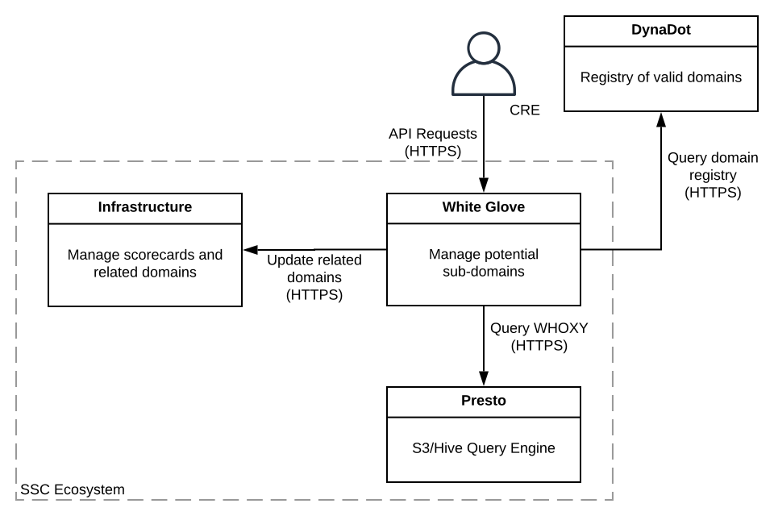
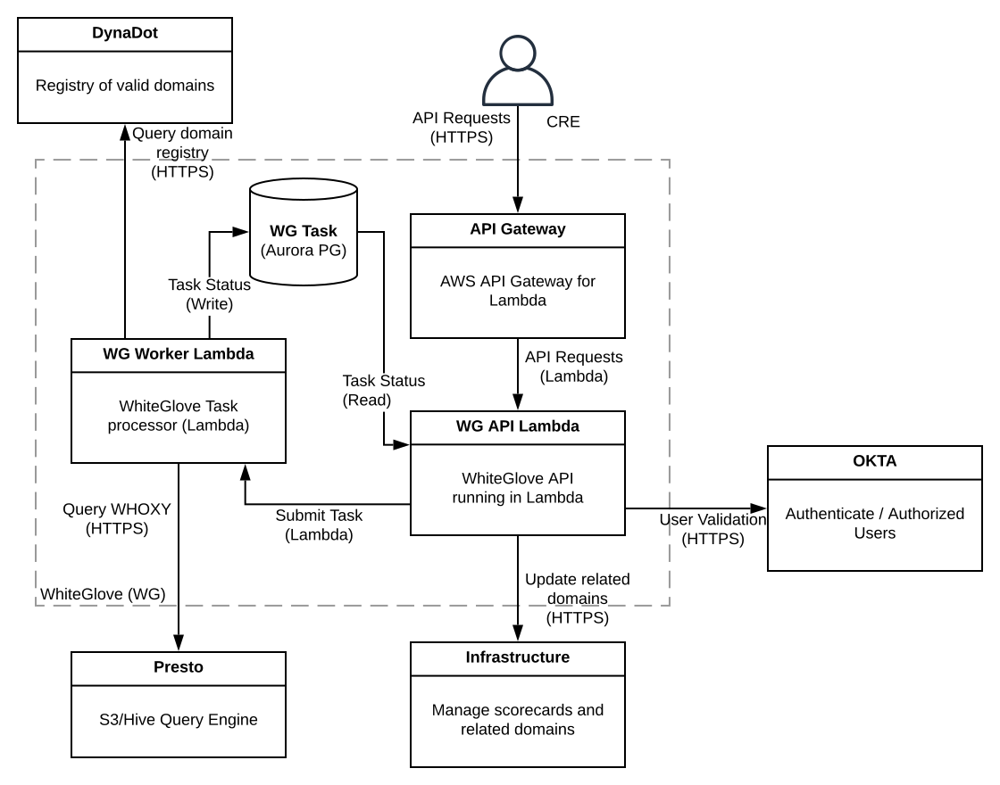
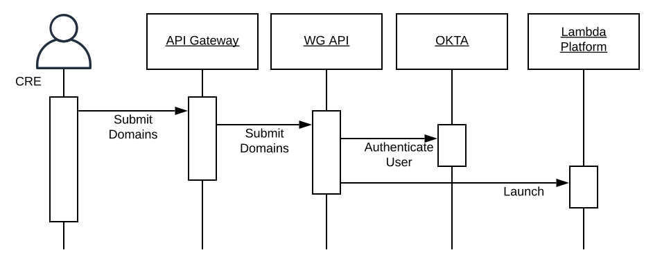
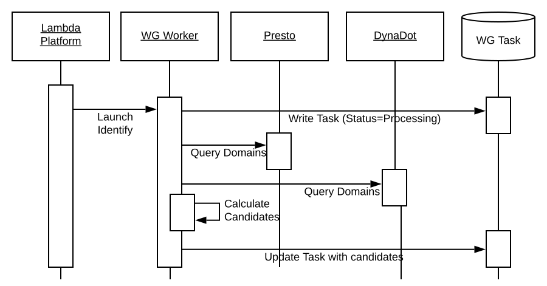
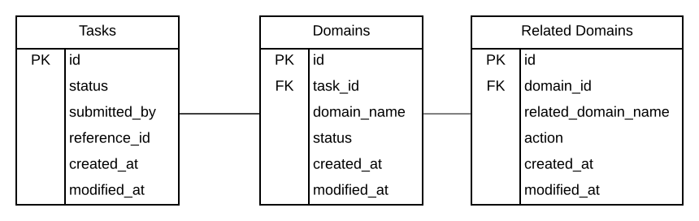

# WhiteGlove Guidebook
__*NOTE:*__ Diagrams were created in LucidChart and can be found [here](https://www.lucidchart.com/documents/view/aed1f5a3-cf39-481e-acb2-9d888f1c1462/0_0).

__*Disclaimer:*__ _The "WhiteGlove" is not an actual SSC product. And the following design and architecture presented is for illustrative purposes only._

## System Context

The WhiteGlove application provides an API for use Customer Reliability Engineers (CREs) to automate 
the identification, review, and adding of related domains to scorecards.

### [System Context Diagram](https://www.lucidchart.com/documents/view/aed1f5a3-cf39-481e-acb2-9d888f1c1462/0_0)

## Functional Overview

CREs receive many requests to add missing sub-domains for a scorecard. This is mostly a manual process 
augmented with some command line scripts. The WhiteGlove application will provide an API that will help 
automate the process of identifying potential related domains, and after CRE review, relating vetted subdomains 
to a scorecard.

### Use Cases

1. CRE submits a list of domains to WhiteGlove to identify potential related domains. The identification
   process can take some time, so the identification should be run in the background--WhiteGlove will 
   acknowledge the request and schedule the identification task.

2. CRE requests status of previously submitted task. If completed, WhiteGlove returns the potentially
   related domains.

3. After reviewing and editing potentially related domains, CRE submits the related domains to WhiteGlove.
   WhiteGlove will add or remove related domains via the InfraStructure API.

4. CRE queries WhiteGlove for list of previously submitted identification tasks. This can include tasks
   submitted by other CREs.

## Quality Attributes

### Performance
  - No special performance requirements -- best effort
### Scalability
  - Support up to 10 CREs submitting up to unique 500 domain lookups per day
### Availability
  - Best effort for availability
  - Support normal business hours (no after hours support required)
### Security
  - OKTA authentication and authorization -- use same as Infrastructure application
  - No special data requirements
### Management
  - N/A
### Disaster Recovery
  - N/A -- can tolerate complete data loss
### Monitoring
  - DataDog metrics
     * Count of domains of submitted
     * Domains per request
     * Related domain determination
### Legal and Compliance
  - N/A
### Auditing
  - N/A
### Data Retention
  - N/A
### Accessibility
  - N/A
### Internationalization / Localization
  - N/A
### Constraints
  - N/A

## Architecture  

### Architecture Design Decisions

The complete list of [design decisions](adr/).

### Deployment

### [Deployment Diagram](https://www.lucidchart.com/documents/view/aed1f5a3-cf39-481e-acb2-9d888f1c1462/0_0)

* _API Gateway_ - AWS Managed service for exposing API
* _WhiteGlove API Lambda_ - Lambda deployed modules that make up the REST API
* _WhiteGlove Worker Lamba_ - Lambda deployed modules that process task requests
* _WhiteGlove Task DB_ - AWS Aurora (Postgres flavor) Database for storing Tasks

### Key Scenarios

#### Submit Domains 
The following diagram shows what happens when a CRE submits a list of domains for identification
of potential domains. The end result is the AWS Lambda scheduling a [Identify Candidate Domains task](#identify_candidate_domains).

#### Identify Candidate Domains  

The following diagram shows how WhiteGlove calculates the candidate related domains.

The basic algorithm is:
1. ...
2. ...
3. ...

#### Update related Domains
_TODO_

## Data Model

The WhiteGlove will submit lookup requests in an Aurora/Postgres database. Both activity and volume will be low.

### Postgres

#### Tasks

List of submitted lookup tasks, including status and results.

#### Domains

#### Related Domains

## API

This [Swagger Document](example.swagger.yaml) describes the WhiteGlove API.

